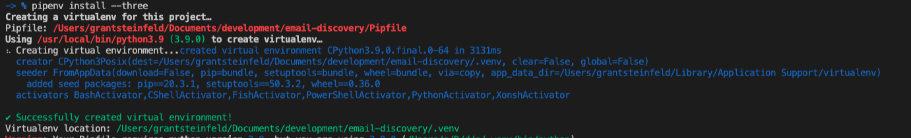
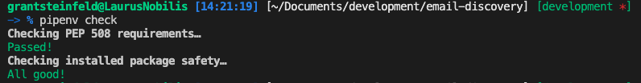
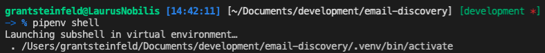

[](https://travis-ci.com/Grant-Steinfeld/email-discovery)


# email parser

This is a Python micro-service that should extract data from input email as text

I will return JSON representation of the email as body text/plain, and headers like to, from email, from name, mail id, date processed

## Typical usecase
Postfix enabled on host linux server (Centos7), `/etc/aliases` file updated to redirect mail to a shell script that calls this microservice which can then decide where to pass the data downstream say to a ML/DL or NLP processor or some kind of database/datalake which can then further analysed


## Included components
1. Python version 3.8 or later
1. Pipenv
1. pytest
1. black
1. flake8


## Local development, run locally by following these steps
## Install the pre-requisites

1. Python version 3
1. Pipenv - Python virtual environment

## Installation steps

### 1. Python3

Make sure you have Python installed and it's availible from your command line. You can check if it's installed and determine it's version by running:

```sh
python --version
```

You shoud get some output like `3.6.2` If you don't have this version of Python, please install the latest `3.x` version.

To install python 3 on a Mac

```sh
brew install python3
```

<details><summary><strong>Installation of Python3 on other platforms</strong></summary>
To [install Python3 on RHEL](https://developers.redhat.com/blog/2018/08/13/install-python3-rhel/)

To [install Python3 on Ubuntu](https://www.digitalocean.com/community/tutorials/how-to-install-python-3-and-set-up-a-programming-environment-on-an-ubuntu-18-04-server)

To [install Python3 on Windows](https://phoenixnap.com/kb/how-to-install-python-3-windows)

To install Python on any other platform take a look at the [Installing Python](https://docs.python-guide.org/starting/installation/) section of **_The Hitchhikers Guide to Python_** or refer to [python.org](http://python.org)

</details>

### Check python version is 3.8 or later!
```sh

python3 -V
#or
python3.8 -V

```

### 2. Pipenv - Python virtual environment

To check you have pipenv installed run the following:

```sh
pipenv --version
```

You should see something like `version 2018.11.26` if not please setup the latest version of pipenv as follows.

To install pipenv on a Mac using brew

```sh
brew install pipenv
```

<details><summary><strong>Installation of Pipenv on other platforms</strong></summary>

> If you have a working installation of pip, and maintain certain “toolchain” type Python modules as global utilities in your user environment, pip user installs allow for installation into your home directory. Note that due to interaction between dependencies, you should limit tools installed in this way to basic building blocks for a Python workflow like virtualenv, pipenv, tox, and similar software.

To install pipenv on anyplatform with `pip`

```sh
pip install --user pipenv

#or
# todo: validate this
python3 -m pip install pipenv

```

For more detailed instruction [see here](https://pipenv-fork.readthedocs.io/en/latest/install.html#installing-pipenv)

</details>

It is a best practice to use use Python virtual environments to isolate project-specific dependencies and create reproducible environments.

<details><summary><strong>Read more about Pipenv and Virtual Environments</strong></summary>

### Pipenv Features

- Pipenv is a production-ready tool that aims to bring the best of all packaging worlds to the Python world. It harnesses Pipfile, pip, and virtualenv into one single command.

- Enables truly **_deterministic builds_**, while specifying only what is needed.

- With pipenv you no longer need to use `pip` and `venv` separately.

* Setting a virtual environment to separate each project from affecting other projects and the rest of your operating system's a good idea. You may be making changes in your virtual environment that could have unintended consequences.

Learn more about Pipenv [here](https://pipenv-fork.readthedocs.io/en/latest/)

</details>

### Intializing a `pipenv` Python Virtual Environment

How does one setup a Python Virtual Environment using `pipenv`?

#### What is a virutal env

It's a copy of a physically installed version of python already have, so say you have python3 install via brew or some other method, you can find this by typing

```sh
which python3

#maybe here
echo '/usr/local/bin/python3'
```

#### You may be asking yourself where your new virtual environment is stored?

Ordinarilly, by default, the `pipenv` virutal enviroments is written to a global (your user's home ) dirctory. The issue here is if you move your project directory this will corrupt the virutal environment.


#### unix/mac
```sh

export PIPENV_VENV_IN_PROJECT=1
# save this line to your ~/.bashrc or ~/.zshrc or equivalent
```

#### PowerShell on Windows 10
```powershell
$env:PIPENV_VENV_IN_PROJECT=1
```


### Creating a new Pipenv Python3 Virtual Environment

At your command line `cd` to the `root directory` of your application

```sh
#install 
pipenv install --three
```

You should now confirm the new local to your project, `Pipenv` Python Virtual Environment by output similar to this:



So great! Now pipenv created a virtual environment and created a `Pipfile` and a `Pipfile.lock`

Check!

```sh
pipenv check
```

Output should confirm all is good!



You can also confirm the virtual environment is setup by confirming a new file called `Pipfile` exists at the root directory.

Even though the `pipenv` virtual environment is setup, you still need to **_activate_** it. This is simply done by running:

```sh
pipenv shell
```



To exit the `Pipenv` Python Virtual environment simply type `exit`


## To run locally follow these steps on Mac OSX
1. ensure you have the pre-requisites as defined above

1. clone this repository `git clone https://github.com/Grant-Steinfeld/email-parser.git`

1. change to the root dir for emailparser `cd src/`
1. install runtime python packages with `pipenv` run: `pipenv install`
1. install dev python packages with `pipenv` run: `pipenv install --dev`
1. run the unit-tests run: `pytest`
1. start the flask microservice run: `python src/main.py`
1. browse to the swagger test harness by navigating to [http://127.0.0.1:7878](http://127.0.0.1:7878)


## License

This application is licensed under the Apache License, Version 2. Separate third-party code objects invoked within this application are licensed by their respective providers pursuant to their own separate licenses. Contributions are subject to the [Developer Certificate of Origin, Version 1.1](https://developercertificate.org/) and the [Apache License, Version 2](https://www.apache.org/licenses/LICENSE-2.0.txt).

[Apache License FAQ](https://www.apache.org/foundation/license-faq.html#WhatDoesItMEAN)
