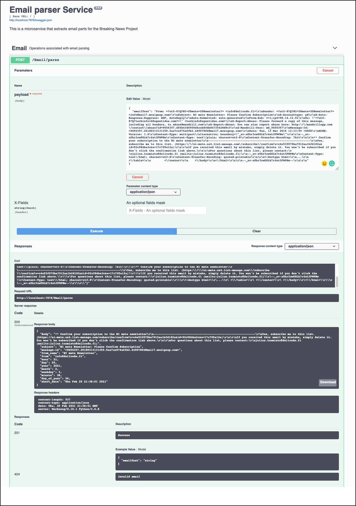

[](https://travis-ci.com/Grant-Steinfeld/email-discovery)


# email parser

This is a Python micro-service that should extract data from input email as text

I will return JSON representation of the email as body text/plain, and headers like to, from email, from name, mail id, date processed

## Typical usecase
Postfix enabled on host linux server (Centos7), `/etc/aliases` file updated to redirect mail to a shell script that calls this microservice which can then decide where to pass the data downstream say to a ML/DL or NLP processor or some kind of database/datalake which can then further analysed


## Included components
1. Python version 3.8 or later
1. Pipenv
1. pytest
1. black
1. flake8


## Local development, run locally by following these steps
## Install the pre-requisites

1. Python version 3
1. Pipenv - Python virtual environment

## Installation steps

### 1. Python3

Make sure you have Python installed and it's availible from your command line. You can check if it's installed and determine it's version by running:

```sh
python --version
```

You shoud get some output like `3.6.2` If you don't have this version of Python, please install the latest `3.x` version.

To install python 3 on a Mac

```sh
brew install python3
```

<details><summary><strong>Installation of Python3 on other platforms</strong></summary>
To [install Python3 on RHEL](https://developers.redhat.com/blog/2018/08/13/install-python3-rhel/)

To [install Python3 on Ubuntu](https://www.digitalocean.com/community/tutorials/how-to-install-python-3-and-set-up-a-programming-environment-on-an-ubuntu-18-04-server)

To [install Python3 on Windows](https://phoenixnap.com/kb/how-to-install-python-3-windows)

To install Python on any other platform take a look at the [Installing Python](https://docs.python-guide.org/starting/installation/) section of **_The Hitchhikers Guide to Python_** or refer to [python.org](http://python.org)

</details>

### Check python version is 3.8 or later!
```sh

python3 -V
#or
python3.8 -V

```

### 2. Pipenv - Python virtual environment

To check you have pipenv installed run the following:

```sh
pipenv --version
```

You should see something like `version 2018.11.26` if not please setup the latest version of pipenv as follows.

To install pipenv on a Mac using brew

```sh
brew install pipenv
```

<details><summary><strong>Installation of Pipenv on other platforms</strong></summary>

> If you have a working installation of pip, and maintain certain “toolchain” type Python modules as global utilities in your user environment, pip user installs allow for installation into your home directory. Note that due to interaction between dependencies, you should limit tools installed in this way to basic building blocks for a Python workflow like virtualenv, pipenv, tox, and similar software.

To install pipenv on any platform with `pip`

```sh
pip install --user pipenv

#or
# todo: validate this
python3 -m pip install pipenv

```

For more detailed instruction [see here](https://pipenv-fork.readthedocs.io/en/latest/install.html#installing-pipenv)

</details>

It is a best practice to use use Python virtual environments to isolate project-specific dependencies and create reproducible environments.

<details><summary><strong>Read more about Pipenv and Virtual Environments</strong></summary>

### Pipenv Features

- Pipenv is a production-ready tool that aims to bring the best of all packaging worlds to the Python world. It harnesses Pipfile, pip, and virtualenv into one single command.

- Enables truly **_deterministic builds_**, while specifying only what is needed.

- With pipenv you no longer need to use `pip` and `venv` separately.

* Setting a virtual environment to separate each project from affecting other projects and the rest of your operating system's a good idea. You may be making changes in your virtual environment that could have unintended consequences.

Learn more about Pipenv [here](https://pipenv-fork.readthedocs.io/en/latest/)

</details>

### Intializing a `pipenv` Python Virtual Environment

How does one setup a Python Virtual Environment using `pipenv`?

#### What is a virutal env

It's a copy of a physically installed version of python already have, so say you have python3 install via brew or some other method, you can find this by typing

```sh
which python3

#maybe here
echo '/usr/local/bin/python3'
```

#### You may be asking yourself where your new virtual environment is stored?

Ordinarilly, by default, the `pipenv` virutal enviroments is written to a global (your user's home ) dirctory. The issue here is if you move your project directory this will corrupt the virutal environment.


#### unix/mac
```sh

export PIPENV_VENV_IN_PROJECT=1
# save this line to your ~/.bashrc or ~/.zshrc or equivalent
```

#### PowerShell on Windows 10
```powershell
$env:PIPENV_VENV_IN_PROJECT=1
```


### Creating a new Pipenv Python3 Virtual Environment

At your command line `cd` to the `root directory` of your application

```sh
#install 
pipenv install --three
```

You should now confirm the new local to your project, `Pipenv` Python Virtual Environment by output similar to this:


So great! Now pipenv created a virtual environment and created a `Pipfile` and a `Pipfile.lock`

Check!

```sh
pipenv check
```

Output should confirm all is good!


You can also confirm the virtual environment is setup by confirming a new file called `Pipfile` exists at the root directory.

Even though the `pipenv` virtual environment is setup, you still need to **_activate_** it. This is simply done by running:

```sh
pipenv shell
```


To exit the `Pipenv` Python Virtual environment simply type `exit`


## To run locally follow these steps on Mac OSX
1. ensure you have the pre-requisites as defined above

1. clone this repository `git clone https://github.com/Grant-Steinfeld/email-parser.git`

1. change to the root dir for emailparser `cd src/`
1. install runtime python packages with `pipenv` run: `pipenv install`
1. install dev python packages with `pipenv` run: `pipenv install --dev`
1. run the unit-tests run: `pytest`
1. start the flask microservice run: `python src/main.py`
1. browse to the swagger test harness by navigating to [http://127.0.0.2:7878](http://127.0.0.2:7878)


### Build and run a docker image locally

We showcase this method, by using the Red Hat's Universal Base Image (UBI).

<details><summary><strong> Learn more about the UBI?</strong></summary>

### Introducing UBI

At the core of containers there is a lighter weight Linux operating system. Most of us may have used Ubuntu or Alpine as the base Operating system.

Red Hat now offers us a good alternative base image, that is essentially the core
of Red Hat Enterprise Linux.  Much like CentOS and Red Hat Enterprise linux derive it's core elements from the OpenSource Fedora project.

This ***Linux alternative from Red Hat*** is called the Red Hat Universal Base Image (UBI).

The UBI comes in a few flavors:

1.  You can choose one of the three base images (`ubi`, `ubi-minimal` and `ubi-init`)
1.  Or language-specific runtime images (e.g. `node.js`, `python`, etc.)

UBI allows one to use associated packages provided by `YUM repositories` which satisfy common application dependencies, like `httpd` (apache web server) etc.


### Take a look at our [Dockerfile](./Dockerfile) and notice the `FROM` directive is using the UBI version 8 (core of Red Hat 8) base image.

```yaml
FROM registry.access.redhat.com/ubi8/ubi
```
</details>

</br>
Now let's build this docker image with the `UBI`.


1. Make sure you are at the root directory of this application.

1. Note your docker-hub username
<details><summary><strong>How to find your docker hub credentials</strong></summary>

> To download Docker Desktop you must create a Docker Hub account.

> To find the username, you can click on at your Docker Desktop icon (Mac) toolbar 


</details>
</br>

1. Build the docker image by running:

### MacOS
```bash
export DOCKERHUB_USERNAME=<your-dockerhub-username>
docker build -t $DOCKERHUB_USERNAME/email-discovery-py:v0.0.2 .
```
### Windows
```bash
SETX DOCKERHUB_USERNAME "your-dockerhub-username"
docker build -t $DOCKERHUB_USERNAME/email-discovery-py:v0.0.2 .
```

<details><summary><strong>Expected output details</strong></summary>

Here is a truncated snippet of the successful output you should see:

```bash
Sending build context to Docker daemon  69.63MB
Step 1/10 : FROM registry.access.redhat.com/ubi8/ubi
 ---> fd73e6738a95

 ...

Collecting flask (from -r requirements.txt (line 13))
  Downloading https://files.pythonhosted.org/packages/9b/93/628509b8d5dc749656a9641f4caf13540e2cdec85276964ff8f43bbb1d3b/Flask-1.1.1-py2.py3-none-any.whl (94kB)

 ...

Successfully built 3b5631170697
Successfully tagged <DOCKERHUB_USERNAME>/email-discovery-py:v0.0.2
```

Notes:

* The docker build process, pulled the RedHat 8 Universal Base Image from the redhat registry.

* The base image is the generic image, i.e. ubi8/ubi.  We could have use the Python 3 language specic flavor of the image but opted for this version for 2 reasons:

1. to show off the yum install features

1. to show how a finer controlled version of the language could have been used, like in our case the latest version (at the time of writing) of Python version 3.8 (note to check docker file version to be sure!)


</details>

Great! So, now lets run the image locally!

```bash
docker run -p 7878:7878 $DOCKERHUB_USERNAME/email-discovery-py:v0.0.2
```

At your command line run: `docker ps` and you should now confirm that the docker container for the email-discovery microservice is up and running.


> Explore the microservice from your browser at
> [http://127.0.0.2:7878](http://127.0.0.2:7878) for documentation about this API's endpoints and a `try-it-out` test harness to actually run the API calls.




## Cloud deployment

### Push your Docker Image to DockerHub


1. To allow changes to the this microservice, create a repo on [Docker Cloud](https://cloud.docker.com/) where you can push the newly modified container. 


```bash
# build your docker image
export DOCKERHUB_USERNAME=<your-dockerhub-username>

docker build -t $DOCKERHUB_USERNAME/email-discovery-py:v0.0.2 .

docker login

# push image to docker hub
docker push $DOCKERHUB_USERNAME/email-discovery-py:v0.0.2

```
<details><summary><strong>What a successful push to docker hub should look like</strong></summary>

```bash
The push refers to repository [docker.io/claraxxxxxx/email-discovery-py]
693f7ba0eeed: Pushed 
225cfc6f0260: Pushed 
2ddc888e45c8: Pushed 
1aac3cbf59e3: Pushed 
85f69e555a1b: Pushed 
1295eae54c9d: Pushed 
v0.0.2: digest: sha256:2aa41155a8bd44bb25tytytyt990ed4d5f455968ef88697463456f249a35654841d size: 1574
```
</details>

### Deploy manually to VM

Now that your docker image is published to DockerHub,
ssh to your remote server and run this command:

```zsh
docker run -d -p 7878:7878 --name email-discovery --restart=always grantsteinfeld/email-discovery-py:v0.0.2
```

### Deploy to RedHat Kubernetes OpenShift cluster

2. Provision an [IBM RedHat OpenShift 4 Service](https://cloud.ibm.com/kubernetes/catalog/openshiftcluster)
and follow the set of instructions for creating a Container and Cluster.

### Deploy the Python microservice image to OpenShift.

You can deploy to OpenShift by either the Web Console browser application, or by using the command line terminal. 

We are going to use the `oc` command line tool in this code pattern. Please check that you have v4.1.0 or later installed.


<details><summary><strong>
Install or verify the oc tool
</strong></summary>
 Run the command below

```bash

#aserctain what version of the oc cli you have installed
oc version

#You should have v4.1 or later installed.
v4.1.0

If you don't already have this installed, please follow instructions to do so here: [`oc` CLI documentation](https://cloud.ibm.com/docs/openshift?topic=openshift-openshift-cli#cli_oc) 

```
</details>

<br/>


### Login to your OpenShift 4 cluster

Launch the `Web Console` by clicking on the blue and white button ( annotated with a number(1) above )

Once in the OpenShift Web Console screen, click on your username and click on the `Copy login command` dropdown option under your username


By clicking on display token hyperlink will reveal your oc login token and command.


use `oc login ... ` to login to your cluster, for example 
```sh
oc login --token=X8bjO-ROAhGUx8S9pvg6767574ysuG9SSgSI6hyg --server=https://c108-e.us-northwest.containers.cloud.ibm.com:31007
```

create a new project

```bash
oc new-project email-service-py
```

you should be able to confirm this by typing:

```bash
oc project
```

next add a new application

```bash
oc new-app $DOCKERHUB_USERNAME/email-service-py:v0.0.2
```


Almost there!  You will need to expose the microservice to the outside world by executing

```bash
oc expose svc/email-service-py

#expected output
> route.route.openshift.io/email-service-py exposed

#get the external URL to access the microservice
oc status

```
You should see `oc status` commands output similar to this

```sh
http://email-discovery-py-email-discovery-py.grantsteinfeld-os-fff-...-000.us.west.containers.appdomain.cloud to pod port 7878 tcp (svc email-discovery-py)
```


Now the route is exposed externally and will be visible via the public internet.


### Congratulations!  

You have now successfully created a Python Flask micro-service container image, using the UBI, and optionally deployed it to Red Hat Kubernetes OpenShift cluster on the IBM Cloud.
